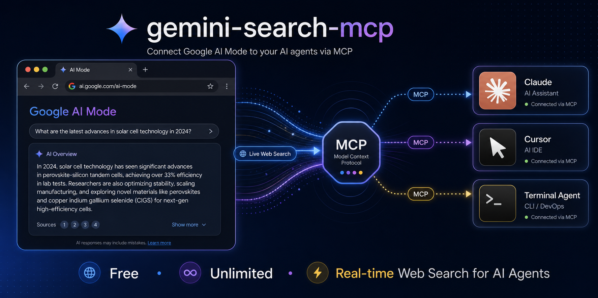

# gemini-search-mcp

<p align="center">
  
</p>

<p align="center">
  
</p>

<p align="center">
  MCP server for web search powered by Google AI Mode (Gemini). Free, unlimited, no API key.
</p>

## What is this

An MCP server that gives any AI agent (Claude, Cursor, Windsurf, etc.) the ability to search the web in real-time using Google's AI Mode — the same Gemini-powered search that lives in the "AI Mode" tab on Google Search.

Think of it as a free, unlimited alternative to Grok MCP / Tavily / SerpAPI, backed by Google's search index.

## Features

- **Free**: No API key, no subscription, no quota
- **Unlimited**: 60+ requests/min with zero rate limiting
- **Google quality**: Powered by Gemini + Google Search (grounded in real web results)
- **MCP native**: Works with Claude Desktop, Claude Code, Cursor, Windsurf, Cline
- **Also ships OpenAI API**: `/v1/chat/completions` for non-MCP clients
- **Fast**: ~1.5s average response time

## Quick Start

```bash
pip install -e .

# Optional: install the undetected-chromedriver backend for CAPTCHA probes.
pip install -e '.[undetected]'
```

### MCP Server (for AI agents)

```bash
gemini-search-mcp
```

### OpenAI-compatible API

```bash
gemini-search --port 8080
```

## MCP Integration

### Claude Code

```bash
claude mcp add gemini-search -- gemini-search-mcp
```

### Claude Desktop

Add to `claude_desktop_config.json`:

```json
{
  "mcpServers": {
    "gemini-search": {
      "command": "gemini-search-mcp",
      "args": [],
      "env": {
        "CDP_URL": "http://127.0.0.1:9222"
      }
    }
  }
}
```

### Cursor / Windsurf

Same pattern — point to `gemini-search-mcp` as an stdio MCP server.

## MCP Tools

| Tool | Description |
|------|-------------|
| `web_search(query)` | Search the web and get a synthesized answer grounded in real-time results |
| `ask(prompt)` | General question — AI Mode auto-decides whether to search the web |

### Examples

```
web_search("latest AI regulation news 2026")
→ "The EU AI Act enforcement began on June 1, 2026, requiring..."

web_search("Bitcoin price today")
→ "As of June 30, 2026, Bitcoin is trading at $59,687 USD..."

ask("what is 1847 * 293")
→ "541171"
```

## OpenAI API Usage

```bash
curl http://localhost:8080/v1/chat/completions \
  -H "Content-Type: application/json" \
  -d '{"model":"gemini-search","messages":[{"role":"user","content":"What happened in the news today?"}]}'
```

| Field | Value |
|-------|-------|
| Base URL | `http://localhost:8080/v1` |
| API Key | anything |
| Model | `gemini-search` |

## Environment Variables

| Variable | Default | Description |
|----------|---------|-------------|
| `CDP_URL` | (none) | Chrome DevTools URL. If set, connects to existing Chrome instead of launching one |
| `BROWSER_CHANNEL` | `chrome` | Browser to use: `chrome`, `msedge`, `chromium` |
| `HEADLESS` | `1` | Set to `0` to show browser window |
| `GEMINI_SEARCH_USER_DATA_DIR` | (none) | Persistent Chrome profile directory. Reuses cookies across runs and is not deleted on shutdown |
| `GEMINI_SEARCH_CDP_PORT` | `19250` | CDP port used for self-launched Chrome |
| `GEMINI_SEARCH_BROWSER_BACKEND` | `subprocess` | Browser launcher: `subprocess` or `undetected` |
| `GEMINI_SEARCH_PROXY_SERVER` | (none) | Chrome proxy server, e.g. `socks5://127.0.0.1:7897` |
| `GEMINI_SEARCH_CHROMEDRIVER` | (none) | Chromedriver executable used by the `undetected` backend |


## Persistent Chrome profile / CAPTCHA priming

If Google shows `/sorry/` CAPTCHA for a fresh temporary profile, prime a persistent profile once in a visible Chrome window, then reuse the same directory in headless mode:

```bash
# 1) Visible first run: solve CAPTCHA manually if Google asks.
gemini-search --no-headless --user-data-dir "$HOME/.local/share/gemini-search-mcp/chrome-profile"

# 2) Later runs: reuse the same cookies headlessly.
GEMINI_SEARCH_USER_DATA_DIR="$HOME/.local/share/gemini-search-mcp/chrome-profile" gemini-search
```

For Windows-side validation from WSL, run the probe with Windows Python through PowerShell so it launches Windows Chrome:

```powershell
$profile = Join-Path $env:TEMP 'gemini-search-mcp-persistent-profile'
python .\scripts\windows_chrome_profile_probe.py `
  --profile-dir $profile `
  --mode two-phase `
  --out .\headless-reuse-result.json
```

Success evidence is `ok=true` and `stages.headless_reuse.captcha=false` in the JSON output.

## undetected-chromedriver CAPTCHA probe

When a normal Chrome subprocess gets a Google `/sorry/` CAPTCHA, install the optional backend and run the reusable probe against `google.com.hk`:

```bash
pip install -e '.[undetected]'
python scripts/uc_google_probe.py \
  --proxy socks5://127.0.0.1:7897 \
  --out-json uc-probe.json
```

Use the backend only when the probe reports `ok=true`, `captcha=false`, and `successful_for_engine_integration=true`.

```bash
gemini-search \
  --browser-backend undetected \
  --proxy-server socks5://127.0.0.1:7897 \
  --chromedriver-path /path/to/chromedriver \
  --no-headless
```

Observed on Windows Chrome for Testing 148 through Clash: headed UC passed (`captcha=false` and AI Mode tokens present), while headless UC hit Google `/sorry/`.

## How It Works

Google rate-limits by TLS fingerprint quality — not by IP. Automated HTTP clients (curl, requests, httpx) get throttled after a few requests. But a real Chrome browser's `fetch()` calls are trusted unconditionally.

This tool runs a single real Chrome tab and executes all queries as `fetch()` inside it over CDP, giving every request an authentic Chrome TLS/HTTP2 fingerprint. Google sees normal browser traffic and applies no rate limits. The optional `undetected` backend still uses the same CDP query path after launch.

```
Agent calls web_search("query")
  → Chrome Runtime.evaluate(fetch)
    → Google Search AI Mode (token extraction + folwr endpoint)
      → Parse answer from HTML response
        → Return to agent
```

## Comparison

| | gemini-search-mcp | Grok MCP | Tavily |
|---|---|---|---|
| Cost | **Free** | xAI API key ($) | API key ($) |
| Rate limit | **None** | API quota | API quota |
| Search backend | Google Search | Grok + web | Proprietary |
| Answer quality | Gemini synthesized | Grok synthesized | Extracted snippets |
| Setup | Chrome + CDP | API key | API key |

## Docker

```bash
docker compose up -d
```

## Requirements

- Python 3.10+
- Chrome, Edge, or Chromium
- Runtime dependencies from `pyproject.toml`
- Optional: `undetected-chromedriver` and `selenium` via `pip install -e '.[undetected]'`

## Limitations

- Requires Chrome/Edge/Chromium installed
- No conversation memory between requests
- Answer extraction relies on Google's DOM structure (may break on updates)
- Streaming is chunked, not per-token

## Acknowledgments

- [GenericAgent](https://github.com/lsdefine/GenericAgent) — 本项目核心开发依仗 GA 提供的 AI 能力
- [linux.do](https://linux.do) community

## License

MIT
